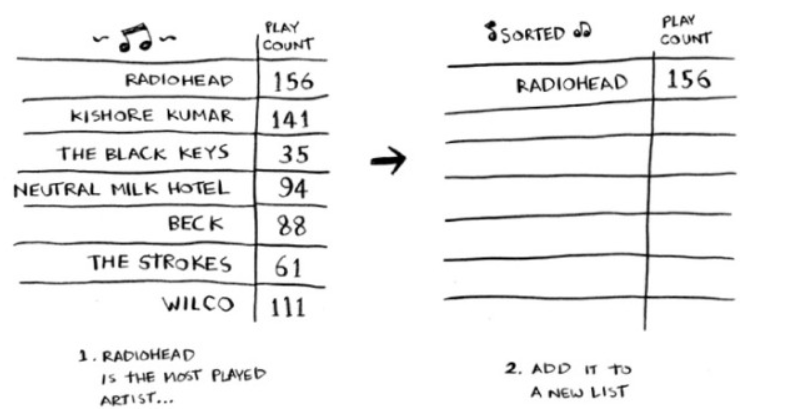

# Chapter 2 - 选择排序

## 1. 内存的工作原理

* 需要将数据存储到内存是，你请求计算机提供存储空间，计算机给你一个存储地址。  
  需要存储多项数据时，有两种基本方式——**数组**和**链表**。数组和链表各有其适用的情形和优缺点。

## 2. 数组和链表

* 使用**数组**意味着所有待办事项在内存中都是相连的（仅靠在一起的）。
  
    如果来了以为新朋友，想坐在邻近的位置没有空位，就需要重新分配内存。**所以，在数组中添加新元素的速度会很慢。**
    一种解决方法时 _预留位置_，以防需要添加待办事项。但这种方法有如下缺点
  * [ ] 额外请求的空间可能根本用不上，将浪费内存。
  * [ ] 待办事项如果超过10个，需要重新进行转移。

### 2.1 链表 （List）

* **链表**中的元素可以存储在内存的任何地方。  
  链表的每个元素都存储了下一个元素的地址，从而使一系列随机的内存地址串在一起。

* 在链表中添加元素很容易：只需要将其放入内存，并将其地址存储到前一个元素中。
* 链表的**优势**在插入元素方面！

### 2.2 数组 (Array)

* 链表存在的问题：在需要读取链表的最后一个元素时，不能直接读取，必须先访问元素#1，从中获取元素#2的地址，再访问元素#2的地址并从中获取元素#3的地址，以此类推，直到最后一个元素。**在需要同时读取所有元素时，链表的效率很高；但如果需要跳跃读取，链表的效率会很低**

* 数组的优势：在需要随机读取元素时，数组的效率很高，我们可以迅速找到数组的任何元素。（数组中所有元素都是靠在一起的）

### 2.3 术语

* 数组的元素代编号，编号从0而不是从1开始。    
  从0开始让基于数组的代码编写起来更容易。几乎所有的编程语言都从0开始对数组元素进行改变好。

* 索引： 元素的位置
  > 如：元素20位于索引1处。

* 常见数组和链表操作的运行时间：

### 2.4 在中间插入

* 当需要在中间插入元素时，链表是更好的选择。  
  链表与数组的插入比较：
  
  

### 2.5 删除

* 在删除操作中，链表也是更好的选择，只需要修改前一个元素指向的地址即可。而是用数组时，删除元素后，必须将后面的元素都向前移。

* 不同于插入，**删除元素总能成功！**如果内存没有足够的空间，插入操作可能失败，但在任何情况下都能够将元素删除。

* 数组和链表操作的运行时间：

* 链表仅支持顺序访问；数组可以支持随机访问。

* 链表擅长：插入和删除
* 数组擅长：随机访问

## 3. 选择排序

> 假设计算机存储了很多乐曲，要将列表按播放次数从多到少的顺序排列，该怎么做？

* 方法1（**选择排序**）：遍历这个列表，找出作品播放次数做多的乐队，并将该乐队添加到一个新列表中。
  * 每次搜索便利的时间为 _O(n)_
  * 对于时间为 _O(n)_ 的操作，我们需要执行n次
  * 需要的总时间为 $O(n * n)$，即 $O(n^2)$。
      
  * 运用此类简单排序算法我们可以对一下内容进行排序
    * [ ] 电话簿中的人名
    * [ ] 旅行日期
    * [ ] 电子邮件（从新到旧）

  > **需要的元素越来越少：** 随着排序的进行，每次需要检查的元素在逐渐减少。第一次检查 n 个元素，但随后检查的元素数以此为 n-1, n-2, ..., 2 和 1.平均每次检查的元素数为
  > $$
  \frac{n + (n-1) + (n-2) + ... + (2) + (1)}{n} = \frac{n + 1}{2}$$
  > 因此运行时间为
  > $$\frac{(n + 1) \times n}{2}$$
  > 但在大O表示法中，省略诸如$\frac{1}{2}$这样的常数（将在第4张进行讨论），因此简单写为$O (n^2)$。

* 选择排序的示例代码：
  ```python
  def FindSmallest(arr):
      smallest = arr[0]   # 存储最小的值
      smallest_index = 0  # 存储最小元素的索引
      for i in range(1, len(arr)):
          if arr[i] < smallest:
              smallest = arr[i]
              smallest_index = i
      return smallest_index

  def SelectionSort(arr): # 定义一个数组排序（选择排序）的函数
      new_arr = []
      # 找出数组中最小的元素，并将其加入到新数组中
      for i in range(len(arr)):
          smallest = FindSmallest(arr)
          new_arr.append(arr.pop(smallest))   # list.pop 用于移除列表中的一个元素(返回从列表中移除的元素对象)
      return new_arr  

  print(SelectionSort([5, 7, 1, 3, 4, 2, 6]))
  ```

## 4. 小结

- [ ] 计算机内存可以类比为抽屉
- [ ] 存储多个元素时，可以使用数组和链表
- [ ] 数组的元素都在一起
- [ ] 链表的元素是分开的，其中每个元素都存储了下一个元素的地址
- [ ] 数组的读取速度很快
- [ ] 链表的插入和删除速度很快
- [ ] 在同一个数组中，所有元素的类型都必须相同（都为 int、double 等）