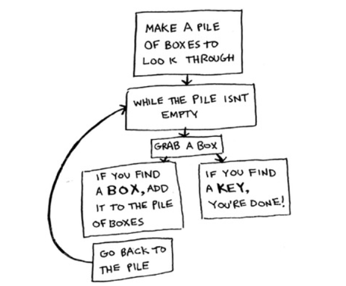
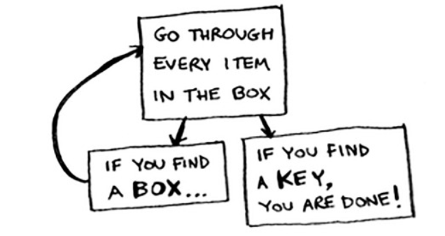
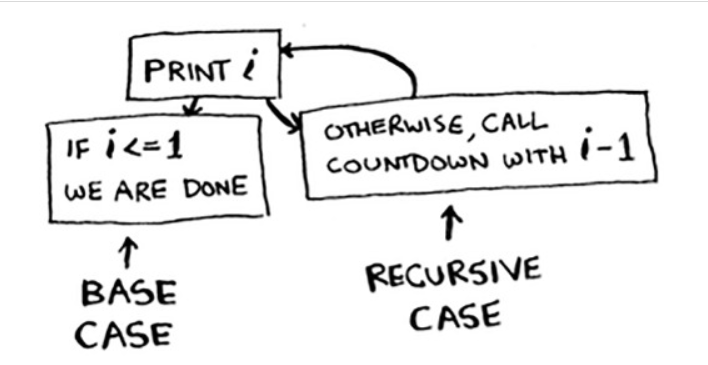
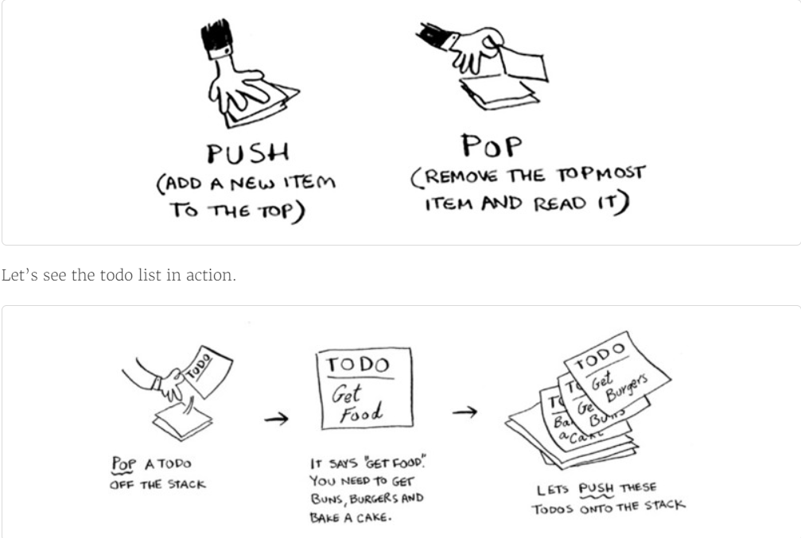
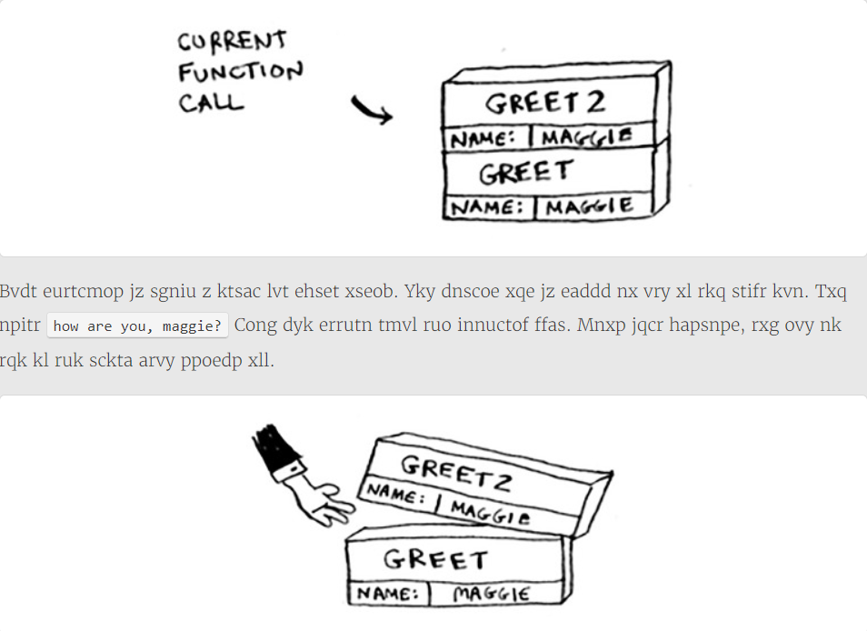
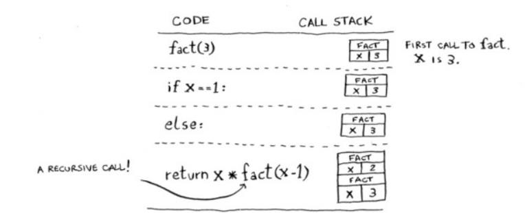
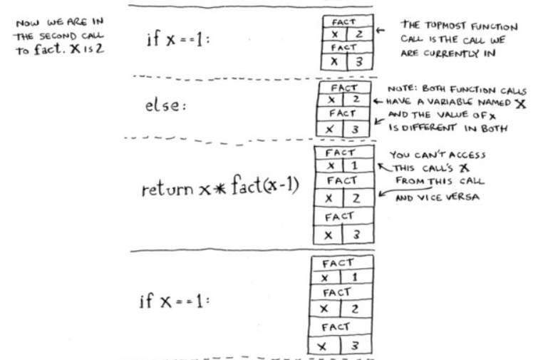
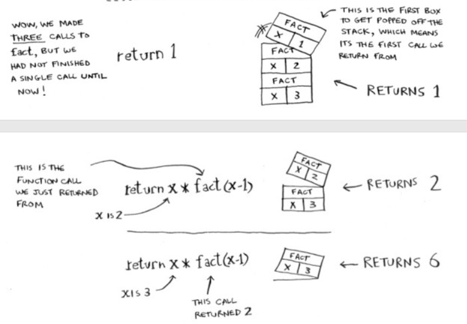
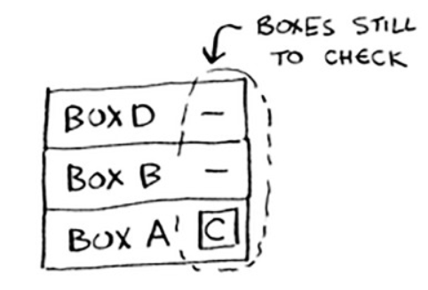

# Chapter-3 递归（Recursion）

* **伪代码：**对手头问题的简要描述，看着像代码，但其实更接近自然语言。

## 1. 递归

> 在不断嵌套盒子的盒子里查找钥匙

* 方法1-while循环图解：
  1. 创建一个要查找的盒子堆
  2. 从盒子堆取出一个盒子，在里面找
  3. 如果找到的是盒子，将其加入盒子堆中，以便以后再查找
  4. 如果找到钥匙，则大功告成！
  5. 回到第二步
    

  * 伪代码如下：

    ```python
    def look_for_key(main_box):
      pile = main_box.make_a_pile_to_look_through()
      while pile is not empty:
          box = pile.grab_a_box()
          for item in box:
              if item.is_a_box():
                  pile.append(item)
              elif item.is_a_key():
                  print("Found the key!")
      return None
    ```

* 方法2：使用"递归"——函数调用自己：
  1. 检查盒子中的每样东西
  2. 如果是盒子就回到第一步
  3. 如果是钥匙，就大功告成！
  

  * 伪代码如下：

    ```python
    def look_for_key(box):
        for item in box:
            if item.is_a_box():
                look_for_key(item)
            elif item.is_a_key():
                print("found the key!")
    ```

* 两种方法作用相同，但相比较而言，第二种方法更清晰。（注意！**递归只是让解决方案更清晰，并没有性能上的优势**）
  >Leigh Caldwell在Stack Overflow上曾说：“如果使用循环，程序的性能可能更高；如果使用递归，程序可能更容易理解。如何选择要看什么对你来说更重要。”

## 2. 基线条件和递归条件

* 由于递归函数调用自己，因此编写这样的函数很容易出错，进而导致无限循环。
  > 如编写倒计时函数
  >
  >> 3...2...1  
  >
  > 我们可以将递归函数编写如下：
  >
  >```python
  >def countdown(i):
  >    print(i)
  >    countdown(i - 1)
  >```
  >
  > 函数会无限运行

* 编写递归函数时，必须告诉他合适停止递归。  
  因此每个递归函数都有两个部分：**基线条件**（base case）和**递归条件**（recursive case）。
  * **递归条件：** 函数调用自己的条件。
  * **基线条件：** 函数不再调用自己的条件。  
  >如刚才的函数countdown，我们可以添加基线条件：
  >
  >```python
  >def countdown(i):
  >    print(i)
  >    if i == 0:   # 递归条件
  >      return
  >    else:    # 基线条件
  >      countdown(i - 1)
  >```
  >
  

## 3. 栈

* 调用栈(call stack)
* 诸如创建待办事项清单。插入的待办事项放在清单的最前面；读取待办事项时，只读取最上面的那个，并将其删除。——我们将这种数据结构称为**栈**。
  * 该待办事项清单只有两种操作：**压入**（插入）和**弹出**（删除并读取）。
  * 图解如下：

### 3.1 调用栈

* 计算机在内部使用被称为**调用栈**的栈。
* 计算机如何使用<调用栈>的示例如下：

  ```python
  def greet(name):
      print("hello, " + name + "!")
      greet2(name)  # 调用"greet2(name)"函数
      print("getting ready to say bye ...")
      bye() # 调用"bye()"函数

  def greet2(name):
      print("how are you, " + name + "?")
  def bye():
      print("OK, bye!")

  greet("Rui TANG")
  ```

  * **注意！**调用另一个函数时，当前函数暂停并处于未完成状态。同时，该函数所有变量的值都还在内存中。执行完greet2后，再回到函数greet，并从离开的地方开始接着往下执行：首先打印"getting ready to say bye...",再调用函数bye。
  
  
  * 在栈顶添加了函数bye的内存块。然后，打印"OK, bye!"，并从这个函数返回。
  
  * 现在又回到了函数greet。由于没有别的事情要做，就从函数greet返回。这个栈用于存储多个函数的变量，被称为**调用栈**。

* **调用栈：**调用栈是解释器（比如浏览器中的 JavaScript 解释器）追踪函数执行流的一种机制。当执行环境中调用了多个函数时，通过这种机制，我们能够追踪到哪个函数正在执行，执行的函数体中又调用了哪个函数。

### 3.2 调用递归栈

* 递归函数也使用调用栈！以利用递归函数factorial(计算阶乘)为例：

  ```python
  def factorial(x):
      if (x == 1):
          return 1
      else:
          return(x * factorial(x-1))

  factorial(5)
  ```
  
  图解如下:
  
  
  

  * **注意！** 每个"factorial函数"调用都有自己的x变量。在一个函数调用中不能访问另一个的x变量。


* 栈在递归中扮演者重要的角色！调用栈类似于：
  
  "盒子堆"存储在了栈中！这个栈包含了未完成的函数调用，每个函数调用都包含了还未检查完的盒子。使用栈很方柏霓，因为无需自己跟踪盒子堆——栈已经替你做好了！

* 使用栈的弊端：  
  存储详尽的信息可能占用大量的内存。每个函数调用都要占有一定的内存，如果栈很高，就意味着计算机存储了大量函数调用的信息。  
  在这种情况下，我们有两种选择：

  - [ ] 重新编写代码，转而使用循环
  - [ ] 使用**尾递归**。 这是一个高级递归主题，不在本书的讨论范围内。同时，不是所有的语言都支持尾递归。

* 如果一个递归函数没完没了地运行。栈将不断地增大。每个程序可使用的调用栈空间都有限。程序用完这些空间后，将会因为栈溢出而终止。

## 4. 小结
- [ ] 递归指的是调用自己的函数。
- [ ] 每个递归函数都有两个条件：基线条件和递归条件（函数调用自己和不调用自己的条件）。
- [ ] 栈有两种操作：压入和弹出。
- [ ] 所有函数调用都进入调用栈。
- [ ] 调用栈可能很长，这将占用大量的内存。