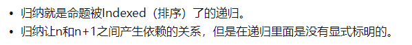

# Chapter-4 快速排序

* 前一章内容深入介绍了递归，本章的重点是使用学到的新技能来解决问题。我们将探索**分而治之(divide and conquer, D&C)** —— 一种著名的递归式问题解决方法。
* 我们讲学习第一个D&C算法——快速排序。快速排序是一种排序算法，速度比第2章介绍的选择排序快得多，实属优雅代码的典范。

## 1. 分而治之

* 使用D&C解决问题的过程包括两个步骤：  
  1. 找出基线条件，这种条件必须尽可能简单。
  2. 不断将问题分解（或者说缩小规模），直到符合基线条件。

* 编写涉及数组的递归函数时，基线条件通常是数组为空或只包含一个元素。陷入困境时，请检查基线条件是不是这样的。

## 2. 快速排序

* 快速排序是一种常用的排序算法，比选择排序快得多。快速排序也是用了**D&C**。

* 对于排序算法来说，最简单的数组是那些根本不需要排序的数组。
  * 因此基线条件数组为空或包含一个元素。

    ```python
    def quicksort(array):
      if len(array) < 2:
          return array
    ```

* 快速排序的工作原理（以包含三个元素的数组为例）：
    1. 从数组中选择一个元素，这个元素被称为基准值(pivot)——理论上我们可以将任何元素用作基准值
    2. 找出比基准值小的元素以及比基准值大的元素。（我们称为分区-partitioning）  
       我们现在有：
       * [ ] 一个由所有小于基准值的数字组成的数组；
       * [ ] 基准值；
       * [ ] 一个由所有大于基准值的数组组成的子数组；
    3. 对两个子数组进行快速排序
    4. 递归地调用快速排序

* **归纳**和**递归**的区别
  

* 快速排序代码：
  ```python
  def quicksort(array):
      if len(array) < 2:
          return array    # 基线条件：为空或者只包含一个元素的数组是有序的
      else:
          pivot = array[0]    # 选择基准值
          less = [
              i for i in array[1:]
              if i <= pivot
          ] # 由所有小于等于基准值的元素组成的子数组

          greater = [
              i for i in array[1:]
              if i > pivot
          ]   # 由所有大于基准值的元素组成的子数组

          return quicksort(less) + [pivot] + quicksort(greater)

  print(
      quicksort(
          [10, 5, 2, 3]
      )
  )
  ```

## 3. 合并排序和快速排序

* 假设有下面这样打印列表中每个元素的简单函数：

  ```python
  def print_items(list):
    for item in list:
      print item
  ```

运行时间为O(n)，现在假设对这个函数进行修改，使其在打印每个元素前都休眠1秒钟：

  ```python
  from time import sleep:
  def print_items2(list):
    for item in list:
      sleep(1)
      print item
  ```

  在大O表示法中O(n)中，n实际上指的是这样的：
  
  c是算法所需的固定时间两，被称为**常量**，例如，print_items所需的时间可能是$10ms * n$，而print_items2所需的时间可能是$1s * n$。

* 有时候，常量的影响可能很大，对于快速排序和合并排序来说就是如此。快速排序的常量比合并排序的常量小，因此如果它们的运行时间都为$O(nlogn)$，快速排序的速度将更快。

## 4. 平均情况和最糟情况

* 在调用栈的每一层都涉及O(n)个元素。

* 最糟糕情况：
  
  在最糟糕的情况中有O(n)ceng ,因此该算法的运行时间为$O(n) * O(n) = O(n^2)$

* 最佳情况：
  
  在这一示例中层数为O(log n)(即调用栈的高度为O(log n)),而每层需要的时间为O(n)。因此整个算法需要的时间为$O(n) * O(log n) = O(n * log n)$ 
  最佳情况也是平均情况。快速排序法是最快的排序算法之一，是D&C的典范。

## 5. 小结

- [ ] D&C将问题逐步分解。使用D&C处理列表时，基线条件很可能是空数组或只包含一个元素的数组。
- [ ] 实现快速排序时，请随机地选择用作基准值的元素。快速排序的平均运行时间为$O(n * log n)$
- [ ] 大O表示法中的常量有时候使馆重大，这就是快速排序比合并排序快的原因所在。
- [ ] 比较简单排序和二分查找时，常量几乎无关紧要，因为列表很长时，$O(n * log n)$比$O(n)$快的多