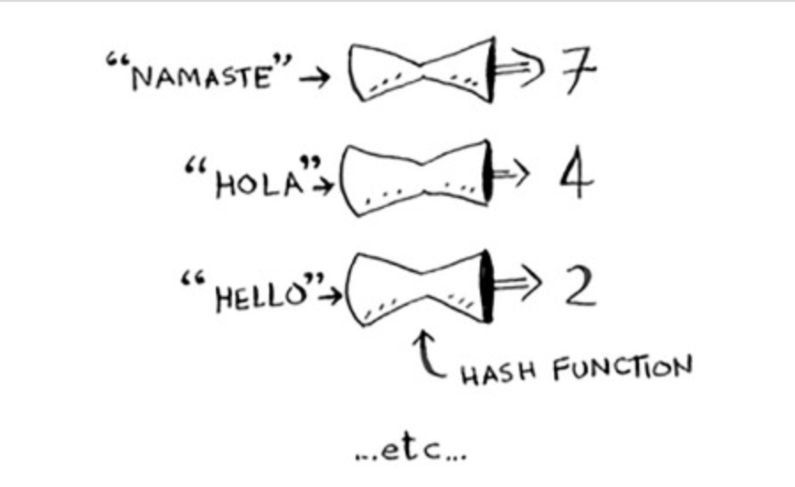
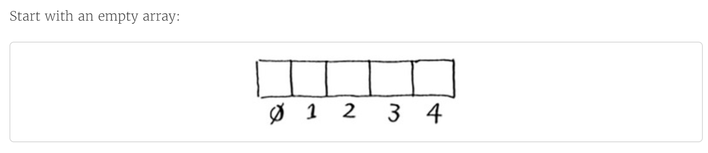
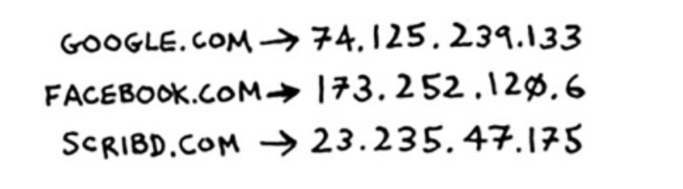
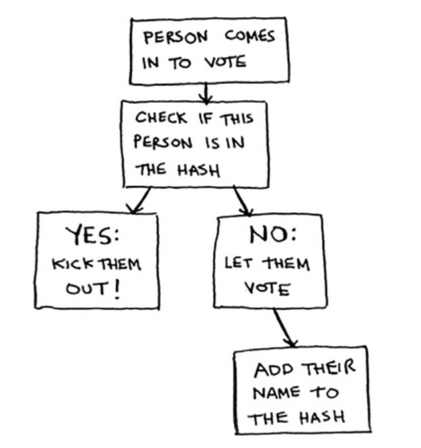
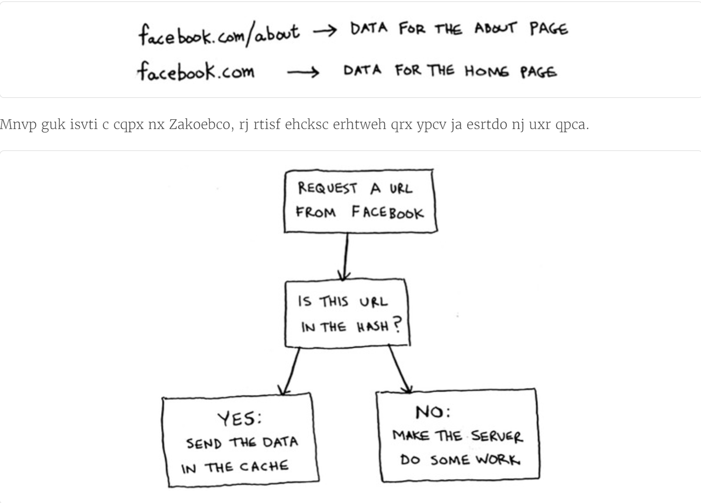
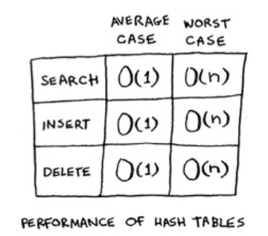
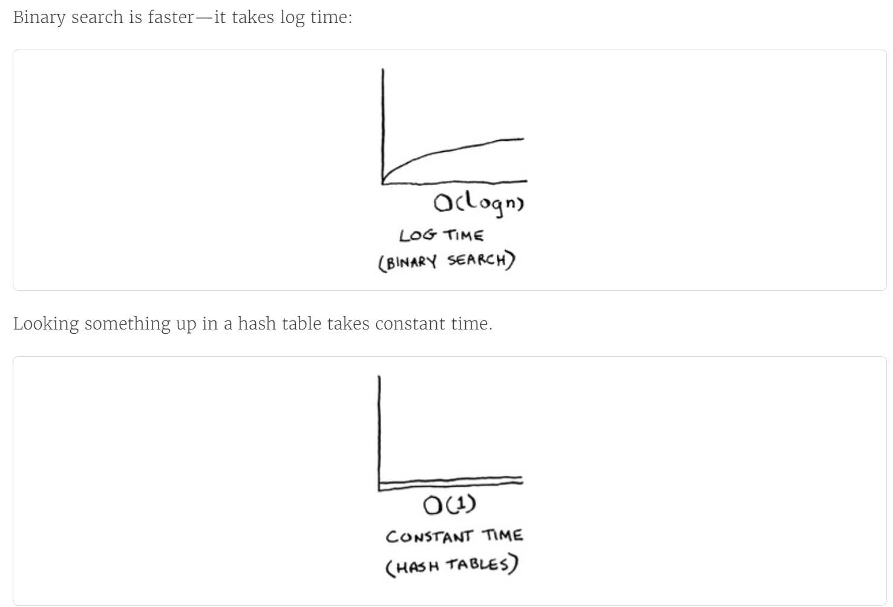
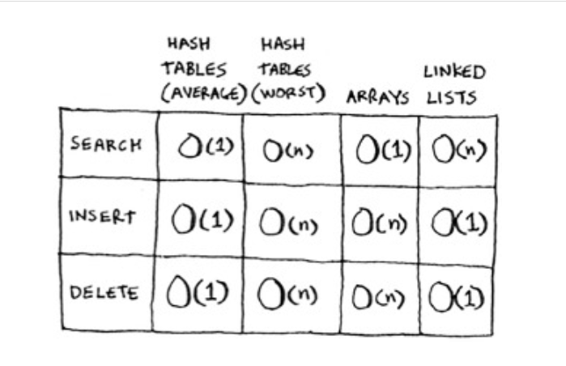
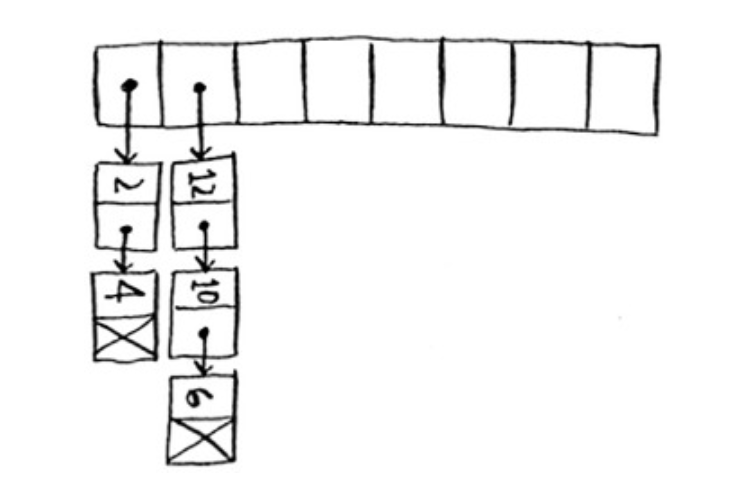

# Chapter-5 Hash Tables(散列表)

* 我们希望查找商品价格的时间为O(1)，这就是散列函数的用武之地。

## 1. 散列函数

* **散列函数**是这样的函数，即无论给它什么数据，它都还你一个数字
  
  * 散列函数“将输入映射到数字”
  * 散列函数必须满足一些要求：
    * [ ] 它必须是一致的。例如， 假设输入apple时得到4，那么，每次输入apple时，得到的都必须为4.
    * [ ] 它应将不同的输入映射到不同的数字。例如， 如果一个散列函数不管输入什么都返回1，它就不是好的散列函数。最理想的情况是，将不同的输入映射到不同的数字。

* 散列函将输入映射为数字的用途：用来打造超级记忆力的"Magggie"!  
  创建空数组
    
  将avocado作为输入交给散列函数
  
  * 散列函数准确地指出了价格的存储位置，我们根本不用查找。原因如下：
    * [ ] 散列函数总是将同样的输入映射到相同的索引。
    * [ ] 散列函数将不同的输入映射到不同的索引。
    * [ ] 散列函数知道数组有多大，只返回有效的索引。如果数组包含5个元素，散列函数就不会返回无效索引100。
  * 我们结合散列函数和数组创建了一种被称为散列表(hash table)的数据结构。这是一种包含额外逻辑的数据结构。

* 数组和链表都被直接映射到内存，但散列表更为复杂，它使用散列函数来确定元素的存储位置。

## 2. 散列表应用案例

### 2.1 将散列表用于查找

* 手机内置了电话普，其中每个姓名都有对应的电话号码。这需要如下功能：
  - [ ] 添加联系人机器电话号码
  - [ ] 通过输入联系人来获悉其电话号码

* 在下述情况下，使用散列表时很不错的选择
  - [ ] 创建映射
  - [ ] 查找

  ```python
  # 运用散列表创建电话簿
  phone_book = dict()
  # or phone_book = {} 两者皆可
  phone_book["jenny"] = 8675309
  phone_book["emergency"] = 110

  print(
      phone_book["jenny"]
  )
  ```

* 散列表被用于大海捞针式的查找。如，无论访问那个网站，网址都必须转换为IP地址。
  
  将网址映射为IP地址的过程也被称为**DNS解析** (DNS resolution)

### 2.2 防止重复

* 假设负责管理一个投票站，每人只能投一票，如何避免重复投票呢？—— 通过散列表，来记录投票过的人员名单。
  

  ```python
  vote = {}
  value = vote.get("tom") # 如果"tom"在散列表中，函数get将返回True，否则将返回None(get函数默认为None)。

  def check_voter(name):
      if vote.get(name):
          print("Kick them out!")
      else:
          vote[name] = True
          print("Let them vote!")

  check_voter("tom")
  check_voter("mick")
  check_voter("tom")
  print(vote)
  ```

### 2.3 将散列表用作缓存

* 缓存的工作原理：网站将数据记住，而不再重新进行计算。
  

* 缓存的优点：
* [ ] 用户能够更快地看到网页。（记住答案，立刻告诉她！）
* [ ] 网站服务器需要做的工作更少。

* 缓存的数据存储在散列表中。
  

* 代码示例：
  ```python
  cache = {}

  def get_page(url):
      if cache.get(url):
          return cache[url]
      else:
          cache[url] = data
          return data
  ```

### 2.4 小结

* 散列表的适用范围：
  * [ ] 模拟映射关系
  * [ ] 防止重复
  * [ ] 缓存/记住数据，以免服务器再通过处理来生成它们。

## 3. 冲突

* 冲突(collision)：给两个键分配的位置相同。

* 处理冲突的方式很多，最简单的方法是：如果两个键映射到了同一个位置，就在这个位置存储一个链表。
  

* 关于散列表的经验教训：
- [ ] **散列函数很重要**。前面的散列函数将所有的键都映射到一个位置，而最理想的情况是，散列函数将键均匀地映射到散列表的不同位置。
- [ ] 如果散列表存储的链表很长，散列表的速度将急剧下降。然而，**如果使用的散列函数很好**，这些链表就不会很长！

## 4. 性能（如何选择好的散列函数）

* 散列表的性能：
  
  
  

* 在使用散列表时，避开最糟情况至关重要。为此，需要避免冲突。要避免冲突，需要：
  - [ ] 较低的填装因子；
  - [ ] 良好的散列函数

### 4.1 填装因子

* 散列表的填装因子计算公式：
  $$\frac{散列表包含的元素数}{位置总数}$$

* 装填因子大于1意味着商品数量超过了数字的位置数。
  

* 一旦填装因子开始增大，你就需要在散列表中添加位置，这被称为**调整长度(resizing)**

* 填装因子越低，发生冲突的可能性越小，散列表的性能越高。(一个不错的经验规则是：一旦填装因子大于**0.7**，就调整散列表的长度)

### 4.2 良好的散列函数

* 良好的散列函数让数组中的值呈均匀分布。
  

* 糟糕的散列函数让值扎堆，导致大量的冲突。
    

## 5. 小结

* 我们可以使用Python提供的散列表，并假定能够获得平均情况下的性能：常量时间。

* 散列表是一种功能强大的数据结构，其操作速度快，还能让我们以不同的方式简历数据模型。

  * [ ] 我们可以结合散列函数和数组来创建散列表。
  * [ ] 冲突很糟糕，我们应使用可以最大限度减少冲突的散列函数。
  * [ ] 散列表的查找、插入和删除速度都非常快。
  * [ ] 散列表适合用于模拟映射关系。
  * [ ] 一旦填装因子超过0.7，就该调整散列表的长度。
  * [ ] 散列表可用于缓存数据。(例如，在Web服务器上)。
  * [ ] 散列表非常适合用于防止重复。  
