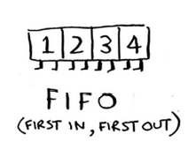

# Chapter-6 广度优先搜索(Breadth-first Search)

* 广度优先搜索(breadth-first search, BFS)：广度优先搜索能够让我们找出两样东西之间的最短距离。使用广度优先搜索我们可以：
  * [ ] 编写国际跳棋AI，计算最少走多少步就可以获胜。
  * [ ] 编写拼写检出器，计算最少编辑多少个地方就可将错拼的单词改成正确的单词，如将READED改为READER需要编辑一个地方；
  * [ ] 根据人际关系网络，找到最近的医生。

## 1. 图简介

* 最短路径问题(shortest-path problem)

* 要确定最短路径问题需要两个步骤：
  
  1. 使用图来建立问题模型。
  2. 使用广度优先搜索解决问题。

* 图由节点(node)和边(edge)组成。
  

* 一个节点可能于众多节点直接相连，这些节点被称为**邻居**。

* 图用于模拟不同的东西是如何相连的。

## 2. 广度优先搜索 

* 广度优先搜索是一种用于图的查找算法，可帮助回答两类问题：
  * [ ] 第一类问题：从节点A出发，有前往节点B的路径吗？(有没有)
  * [ ] 第二类问题：从节点A出发，前往节点B的哪条路径最短？(最短的)

* 广度优先算法举例：在朋友和朋友的朋友...中查找芒果经销商。使用**广度优先搜索**算法搜遍自己的整个人际关系网，直到找到芒果销售商。
  

### 2.1 查找最短路径


* 先查找一度关系再查找二度关系(一度关系在二度关系之前加入查找名单)

* 广度优先搜索不仅查找从A到B的路径，而且找到的还是最短的路径。
  

* 注意：只有按添加顺序查找是，才能实现这样的目的。

* 有一个可实现按添加顺序进行检查的数据结构：队列(queue)

### 2.2 队列

* 队列类似于栈，不能随机地访问队列中地元素。队列只支持两种操作：**入队**和**出队**。
  

* 队列和栈的区别：
  * 队列：**先进先出**(First in First Out, FIFO)
    
  * 栈：**后进先出**(Last in First Out)
    

## 3. 图的实现

* 散列表能让我们将键(Key)映射到值(Value)
  
  ```python
  graph = {}
  graph["you"] = ["allice", "bob", "claire"]
  graph["bob"] = ["anuj", "peggy"]
  graph["alice"] = ["peggy"]
  graph["claire"] = ["thom", "jonny"]
  graph["anuj"] = []
  graph["thom"] = []
  graph["jonny"] = [] 

  print(graph["you"])
  ```
  > graph["you"]是一个数组，其中包含了"you"的所有邻居

  * 键-值对的添加顺序不重要，对字典无影响。散列表是**无序**的。

* 注意：上述为有向图(directed graph)：如，我们可以说Anuj是Bob的邻居，但Bob不是Anuj的邻居。
* 无向图(undirected graph)没有箭头，直接相连的节点互为邻居。例如，下面两个图是等价的。
  

## 4. 实现算法

* 算法工作原理：
  

* "入队" = "压入"
  "出队" = "弹出"

* 算法实现(删除重复参数):
  
  ```python
  graph = {}
  graph["you"] = ["alice", "bob", "claire"]
  graph["bob"] = ["anuj", "peggy"]
  graph["alice"] = ["peggy"]
  graph["claire"] = ["thom", "jonny"]
  graph["anuj"] = []
  graph["thom"] = []
  graph["jonny"] = [] 
  graph["peggy"] = [] 

  from collections import deque

  def person_is_seller(name):
      return name[-1] == "m"  #如果函数检查人的名字是以m结尾，则是芒果经销商。

  def search(name):
      search_queue = deque()
      search_queue += graph[name]
      searched = []
      while search_queue: #只要搜索的队列不为空
          person = search_queue.popleft()
          if person not in searched:
              if person_is_seller(person):
                  print(
                      person +  " is a mongo seller"
                  )
                  return True
              else:
                  search_queue += graph[person]
                  searched.append(person)
      return False

  search("you")
  ```

* 运行时间：
  * 我们沿着每条边前行，因此运行时间至少为O(边数)
  * 同时，我们呢使用了队列，其中包含要检查的每一个人。将一个人添加到队列需要的时间是固定的，即为O(1)，因此，对每个人都这样做需要的总时间为O(人数)
  * **广度优先搜索算法的运行时间为O(人数+边数)，我们通常写为 _O(V + E)_，其中V为顶点数(Vertices),E为边数(Edges)。**

* 
* 从某种程度上讲，这种列表是有序的。如果任务A依赖于任务B，在列表中任务A就必须在任务B后。这被称为**拓扑排序**，使用它可以根据图创建一个有序列表。

* 这种图被称为**树**。树是一种特殊的图，其中没有往后指的边。
  

* A/C是树，B是图。因此，**树是图的子集，树都是图，但图可能是树，也可能不是**。
  
  
## 4. 小结

* [ ] 广度优先搜索指出是否有从A到B的路径。
* [ ] 如果有，广度优先搜索将找出最短路径。
* [ ] 有向图的边为箭头，箭头的方向指出了关系的方向。如rama->adit表示rama前adit钱。
* [ ] 无向图的边不带箭头，关系是双向的。如rama-adit可以表示为rama和adit在约会，而adit也在和rama约会。
* [ ] 队列：先进先出(FIFO)
* [ ] 栈：后进先出(LIFO)
* [ ] 我们需要按加入顺序检查搜索列表中的人，否则找到的就不是最短路径，因此搜索列表必须是队列。
* [ ] 对于检查过的人，无比不要再去检查，否则可能无限循环。