# Chapter-7 狄克斯特拉算法

- **广度优先搜索**找出的的是段数最少的路径。如果我们要找出最快的路径，可以使用另一种算法-**狄克斯特拉算法(Dijkstra's algorithm)**

- 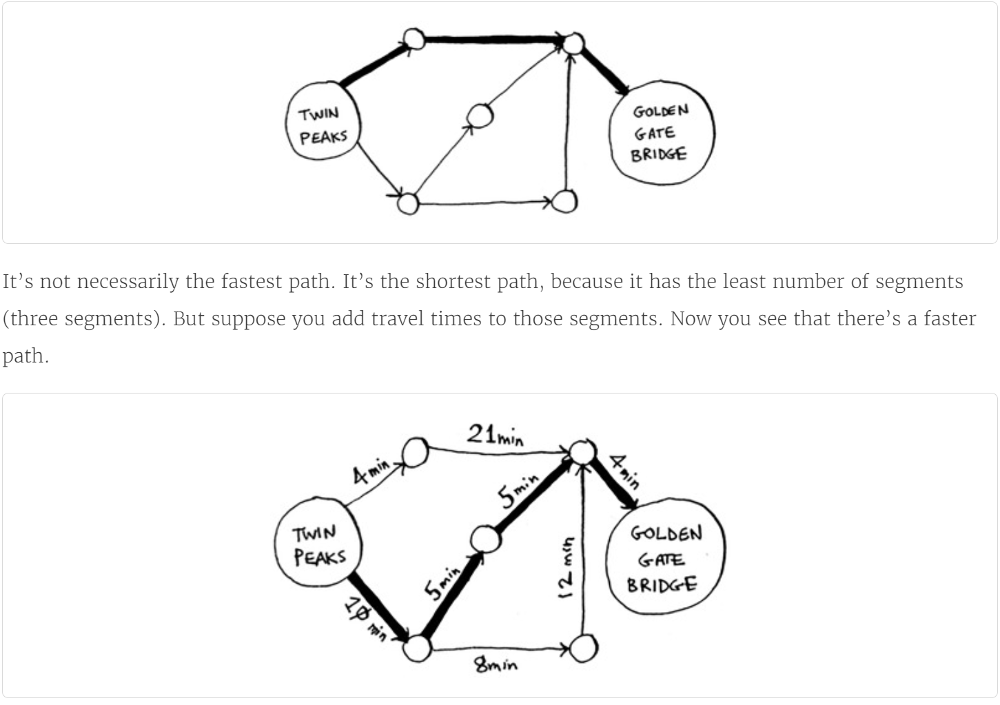

## 1. 使用狄克斯特拉算法

- 例如，对下面的图使用Dijkstra's algorithm找出从起点到重点耗时最短的路径.
  

- 狄克斯特拉算法的四个步骤
  1. 找出"最便宜"的节点，即可在最短时间内到达的节点。
  2. 对于该节点的邻居，检查是否有前往它们的更短路径，如果有，就更新其开销。
  3. 重复这个过程，直到对图中的每个节点都这样做了。
  4. 计算最终路径。

- 在狄克斯特拉算法中，我们给每段都分配了一个数字或权重，因此狄克斯特拉算法找出的是总权重最小的路径。
  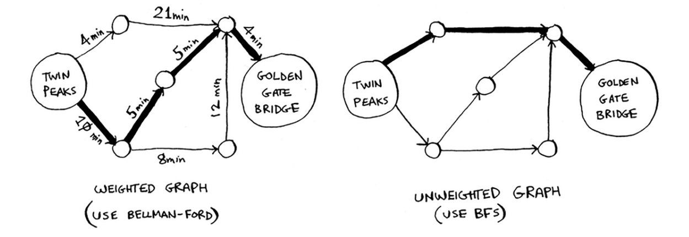

## 2. 术语

- 狄克斯特拉算法用于每条边都有关联数字的图，这些数字称为**权重**(weight)。
- 带权重的图称为**加权图**(weighted graph)，不带权重的图称为**非加权图**(unweighted graph)。
  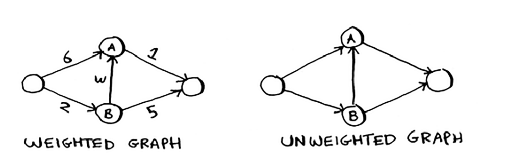

- 计算非加权图使用广度优先搜索，计算加权图使用狄克斯特拉算法。图中可能还有环，类似这样：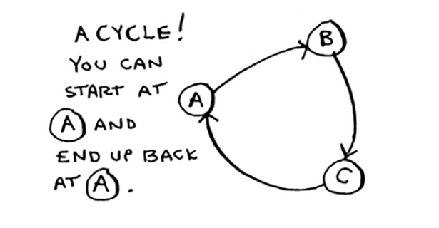

- 在无向图中，每条边都是一个环。狄克斯特拉算法只适用于**有向无环图**(directed acyclic graph, DAG)。
  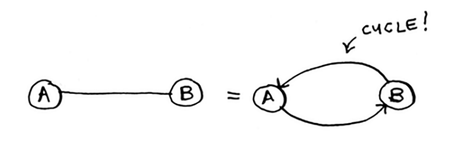

## 3. 换钢琴

- 狄克斯特拉算法背后的关键理念：**找出途中最便宜的节点，并确保没有到该节点的最便宜的路径！**

- 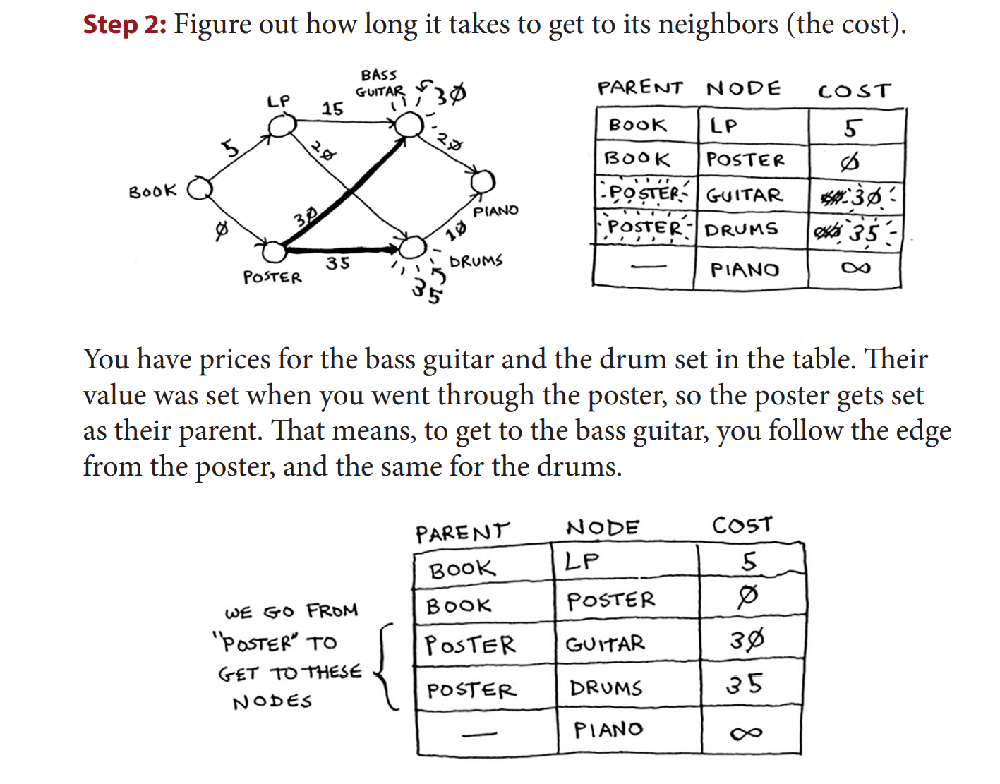
- 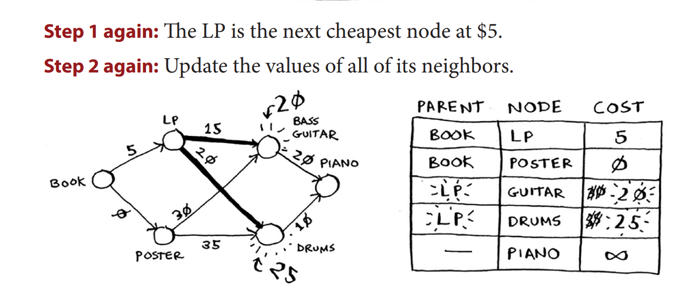
- 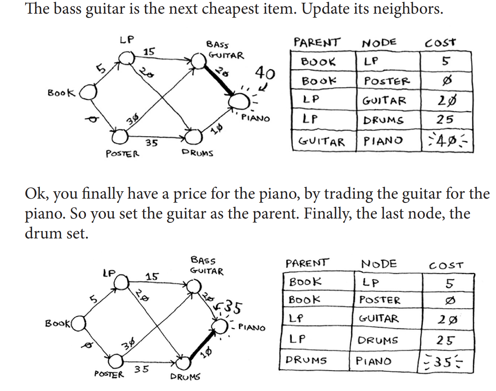
- 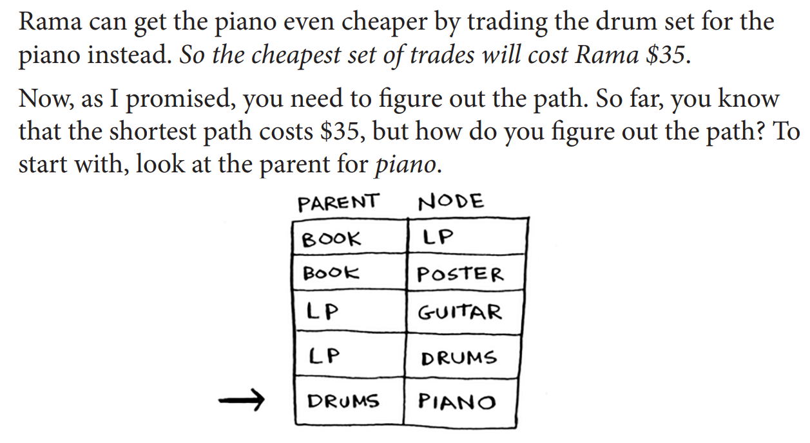
- 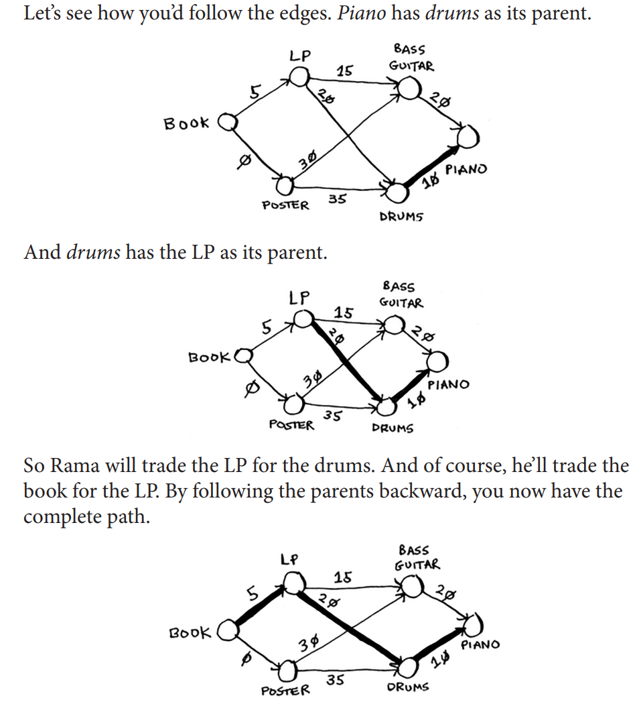

## 4. 负权边

- 如果有负权边，就不能使用狄克斯特拉算法。因为负权边会导致这种算法不管用。

- 狄克斯特拉算法这样假设：对于处理过的海报节点，没有前往该节点的更短路径。这种假设只在没有负权边的时候才能成立。因此，**不能将狄克斯特拉算法用于包含负权边的图**。

- 在包含负权边的图中，要找出最短路径，可以使用另外一种算法——**贝尔曼-福德算法(Bellman-Ford algorithm)**。

## 5. 狄克斯特拉算法的实现

- 以下面的图为例：
  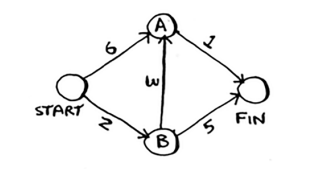

- 要解决这个问题，需要三个散列表。
  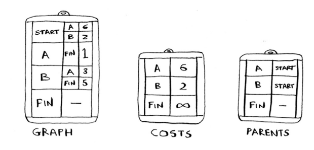
  随着算法的进行，我们将不断地更新散列表costs和parents。

- 代码实现流程图
  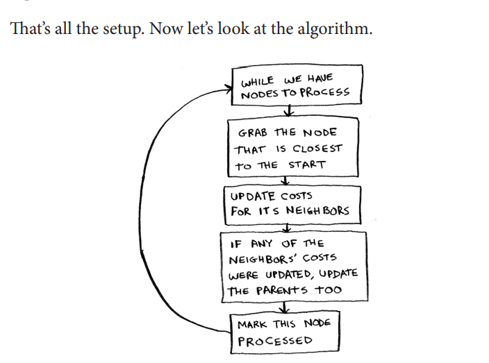

## 6. 小结

- [ ] 广度优先搜索用于在非加权图中找出最短路径
- [ ] 狄克斯特拉算法用于在加权图中查找最短路径
- [ ] 仅当权重为正时，狄克斯特拉算法才管用
- [ ] 如果图中包含负权边，请使用贝尔曼福德算法 
