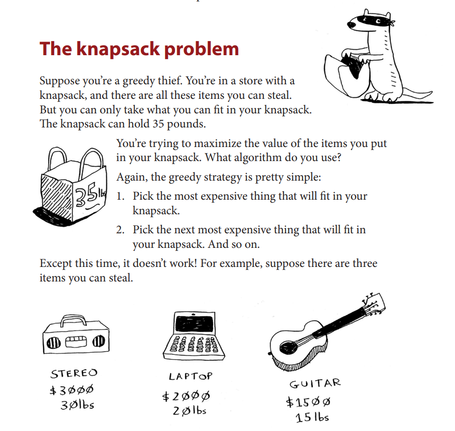
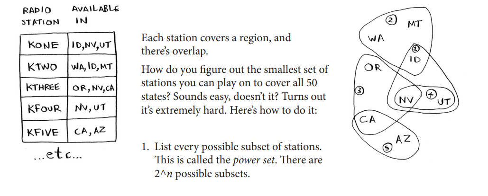
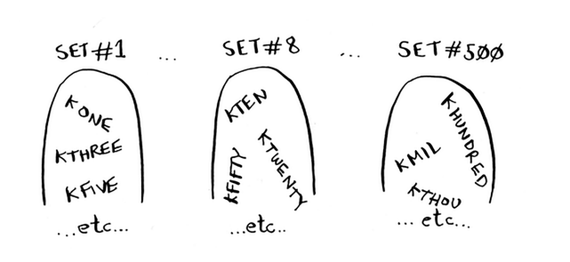
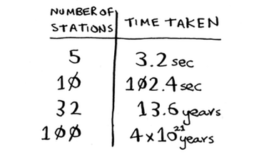
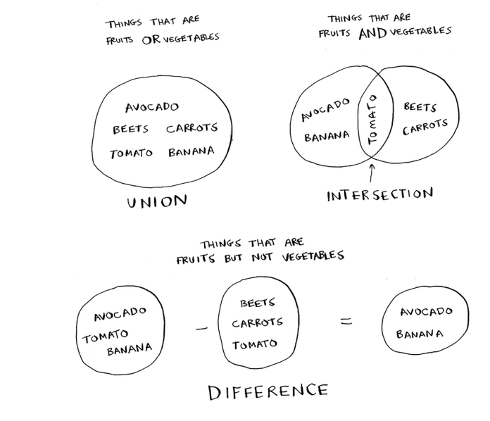
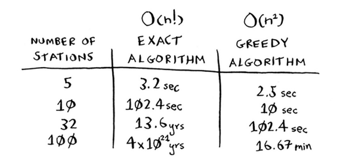
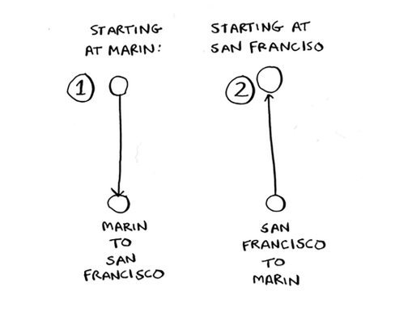
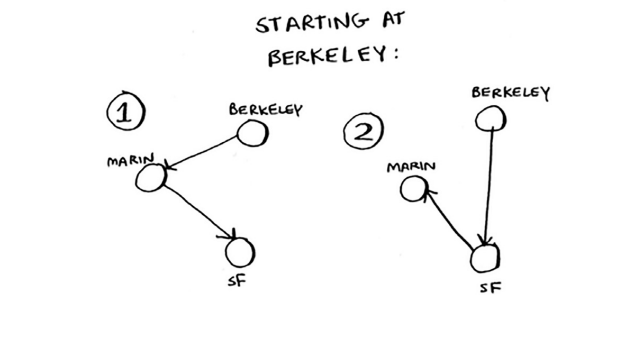
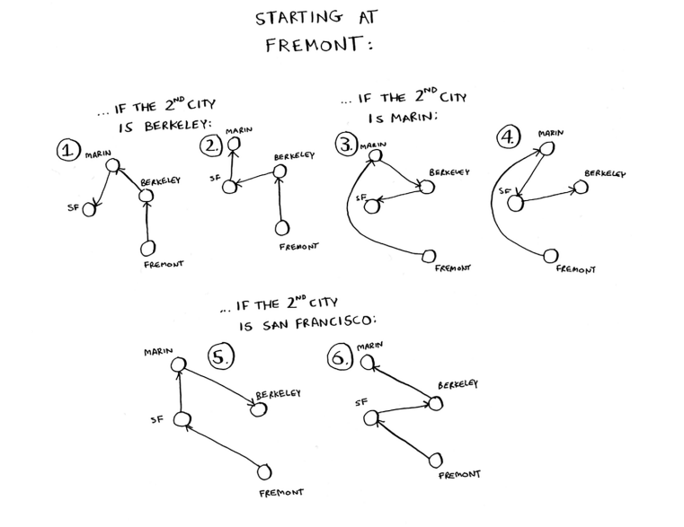
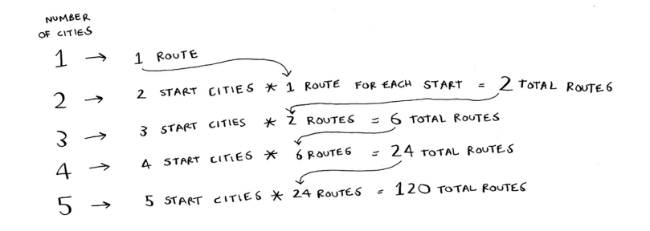

# Chapter-8 Greedy algorithms 贪婪算法

## 8.1 教室调度问题

- 贪婪算法的优点：简单易行

- 贪婪算法的做法：每步都采取最优的做法。(每步都选择局部最优解，最终得到的就是全局最优解)

- 贪婪算法并不是在任何情况下都行之有效，但它易于实现！

## 8.2 背包问题

- 在有些情况下，完美是优秀的敌人。有时候，我们只需要找到大志解决问题的算法，此时，贪婪算法正好可以派上用场，因为它们实现起来很容易，得到的结果又与正确结果相当接近。

##  8.3 集合覆盖问题

- 假设我们办了一个广播节目，要让全美50个州的听众都听得到。为此，我们需要决定在哪些广播台播出。在每个广播台播出都需要支付费用，因此我们力图在尽可能少的广播台播出。
  假设广播台名单如下：

- 如何找出覆盖全美50个州的最小广播台集合？具体方法如下：
  1. 列出每个可能的广播台集合，这被称为**幂集(power set)**，可能的子集有$2^n$个。(每个元素与各个子集的关系有两种：$a_i$属于子集或$a_i$不属于子集，根据分布乘法计数可得到该结果)
     
  2. 在这些集合中，选出覆盖全美50个州的最小集合。

- 随着广播电台数量的增加，需要的时间将激增。假设我们每秒可以计算10个子集，所需要的时间将如下：
  - 没有任何算法可以足够快速地解决这个问题！我们的做法如下。

### 3.1 近似算法

- 运用贪婪算法进行近似：
  1. 选出一个广播台，即覆盖了最多的未覆盖州。即便这个广播台覆盖了一些已覆盖州也没有关系。
  2. 重复第一步，知道覆盖了所有的州。

- 这是一种近似算法(approximation algorithm)。在获得精确解需要的时间太长时，可使用近似算法。判断近似算法优劣的标准如下:
  - [ ] 速度有多快
  - [ ] 得到的近似解与最优解的接近程度

- 在我们上述的例子中，贪婪算法的时间复杂度为$O(n^2)$，其中n为广播台的数量

- 算法详解见文件：[Greedy algorithms](Greedy_algorithms.py)

- 各类集合的意义：
- [ ] 并集意味着将集合合并
- [ ] 交集意味着将找出两个集合中都有的元素
- [ ] 差集意味着将从一个集合中剔除出现在另一个集合中的元素
- [ ] 集合类似于列表，只是不能包含重复的元素

- 贪婪算法和精确算法的运行时间比较:
  

## 8.4 NP完全问题

- 注意：旧金山到马林的距离与从马林到旧金山的距离不一定是相同的！
  

- 在旅行商问题中，不一定从特定的城市出发。要分两种情况进行讨论。  
  在两种情况下，运行时间是相同的。但出发城市未定时更容易处理。在此，我们以这种情况为例。  
  涉及两个城市时，可能的路线有两条。

1. 3个城市
   - 假设从伯克利出发，前往另外两个城市
     
   
   - 从每个城市出发都有两条不同的路线，因此总共有6条路线。

2. 4个城市
   - 
   - 从每个城市出发都有6条路线，我们可以有4个城市可以作为起点，因此，可能的路线有$4\times6 = 24$条。

- 我们每增加一个城市，需要计算的线路都将增加。(以阶乘的个数向上增加)
  

- 旅行商问题和集合覆盖问题的共同点: 你需要计算所有的解，并从中选出最小/最短的那个。这两个问题都属于NP问题。

- NP问题的定义：NP完全问题(NP-C问题)，是世界七大数学难题之一。 NP的英文全称是Non-deterministic Polynomial的问题，即多项式复杂程度的非确定性问题。简单的写法是 NP=P？，问题就在这个问号上，到底是NP等于P，还是NP不等于P。(我们可以简单定义为**以难解著称的问题**，如旅行商问题和集合覆盖问题)

### 4.1 如何识别NP完全问题

- 要判断问题是不是NP完全问题很难，易于解决的问题和NP完全问题的差别通常很小。

- 判断NP问题的一些标准：
  - [ ] 元素较少时，算法的运行速度非常快，但随着元素数量的增加，速度会变得非常慢
  - [ ] 涉及"所有组合"的问题通常都是NP完全问题
  - [ ] 不能将问题分成小问题，必须考虑各种可能的情况。这可能是NP完全问题
  - [ ] 如果问题设计序列(如旅行商问题中的城市序列)且难以解决，它可能是NP完全问题
  - [ ] 如果问题设计集合(如广播集合)且难以解决，它可能是NP完全问题
  - [ ] 如果问题可转换为集合覆盖问题或旅行商问题，那它肯定是NP完全问题！

## 8.5 小结

- [ ] 贪婪算法寻找局部最优解，企图以这种方式获得全局最优解
- [ ] 对于NP完全问题，还没有找到快速解决方案
- [ ] 面临NP完全问题时，最佳的做法是是哟个近似算法
- [ ] 贪婪算法易于实现，运行速度快，是不错的近似算法