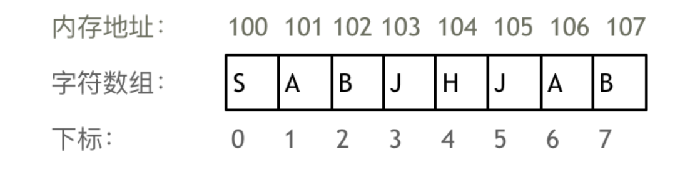
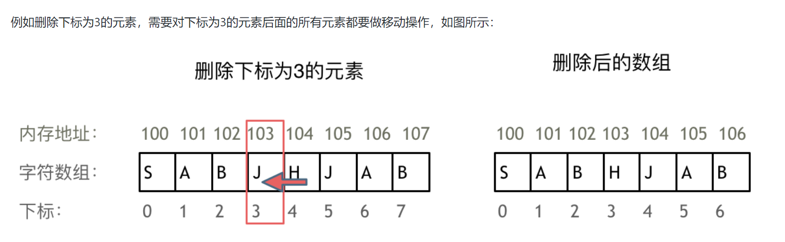
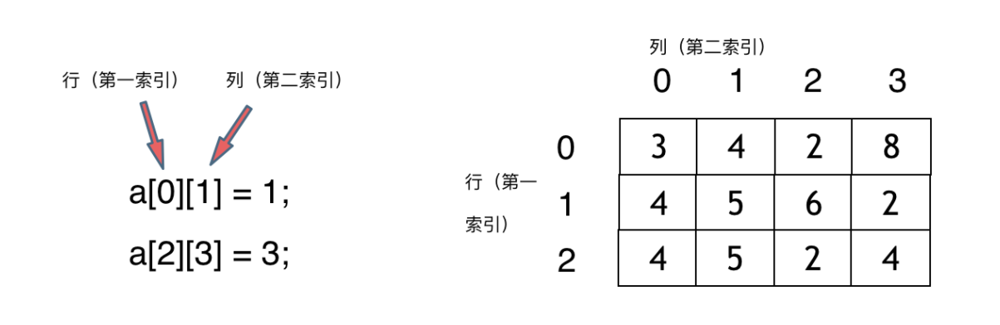
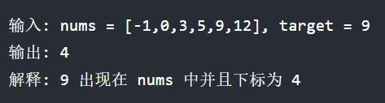
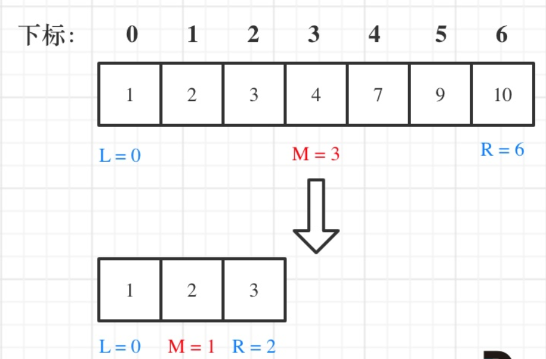
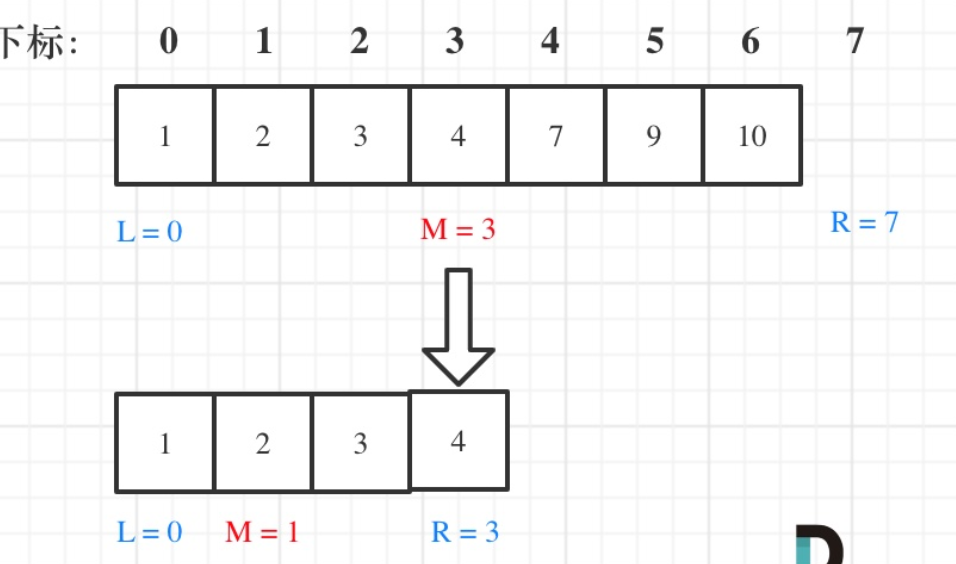

# 1. 数组 - 理论知识

## 1.1. 一些基本概念

- 数组：数组是存放在持续内存空间上的相同数据类型的集合
  - **数组的下标是从0开始的。**
  - **数组内存空间的地址是连续的。**

- 

- 因为数组的内存空间地址是连续的，所以我们再删除或者增添元素的时候，就难免要移动其他元素的地址。（**区别于链表**）

- 

- C++中"vector"和"array"的区别：vector的底层实现是array，严格来讲vector是容器，不是数组。

- **数组中的元素不能删，只能覆盖**

- 二维数组的索引：
  

- **在C++中二维数组的地址空间中是连续的**

## 1.2. 二分查找

> 题目：给定一个 n 个元素有序的（升序）整型数组 nums 和一个目标值 target  ，写一个函数搜索 nums 中的 target，如果目标值存在返回下标，否则返回 -1。

### 1.2.1. 题解思路：

- 前提：有序数组，且数组中无重复元素！（若有重复元素，使用二分查找返回的元素下标可能不唯一）
- 属于二分查找的前提条件。

- 易错点：**对区间的定义没有想清楚，区间的定义就是不变量。**

- 循环不变量规则：要在二分查找的过程中，保持不变两，就是在while寻找中每一次边界的处理都要根据区间的边界定义来操作！

- 写法1：左闭右闭区间，**[left, right]**
  - while (left <= right) 要使用 <= ，因为left == right是有意义的，所以使用 <=
  - if (nums[middle] > target) right 要赋值为 middle - 1，因为当前这个nums[middle]一定不是target，那么接下来要查找的左区间结束下标位置就是 middle - 1
  - 

- 写法2：左闭右开区间
  - while(left < right)，这里使用<，因为left == right在区间[left,right)上是没有意义的
  - if(nums[middle] > target)right更新为middle，因为当前nums[middle]不等于target，去左区间继续寻找，而寻找区间是左闭右开的，所以right更新为middle，即：下一个查询区间不会比较nums[middle]。
  - 

- 移位运算符效率比除法更快:
  - 左移：$"<<n" = (\times2^n)$
  - 右移：
  - $$">>n" = \frac{1}{2^n} $$

## 1.3. 数组题总结

- 数组在内存中的存储方式：
  **数组是存放在连续内存空间上的相同类型数据的集合。** 
  数组可以方便的通过下标索引的方式获取到下标下对应的数据。

- 注意点：
  - **数组的下标都是从0开始**
  - **数组内存空间的地址是连续的**

- 因为数组的内存空间是连续的，我们在删除或者增添元素的时候，就难免要移动其他元素。

- C++中的实现注意：
  - vector的底层实现是array
  - 但严格来讲vector是容器，不是数组

- **数组的元素是不能删除的，只能覆盖**

- 二维数组的内存空间不是连续的：
  - **如`int[][] rating = new int[3][4];`这个二维数组在内存空间不是`3*4`的连续地址空间，而是由四条连续的地址空间组成。**

- **数组的经典题目：**
  - [ ] 二分法（循环不变量原则）
  - [ ] 双指针法
  - [ ] 滑动窗口
  - [ ] 模拟行为（循环不变量原则）