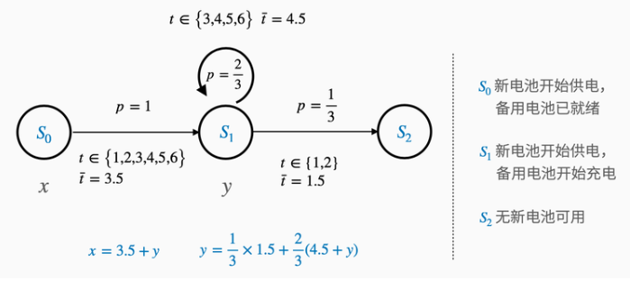

# 随机模拟的方法论

## 随机模拟方法

- 随机模拟方法：通过**仿真随机系统的运行**来获得系统的状态变化与输出结果的大量数据，进而对所得数据进行统计分析，估算系统行为的某些特征，并将估计的误差控制在一定该范围内。

- 随机模拟的作用：
  - 得到解析解很困难或没有解析解时
  - 有解析解时可用于验证解析解的正确性

- 随机模拟基本方法论：描述系统——设置变量——运行规则——模拟系统——抽样与统计——解释结果。

- 数学建模常见的模型
  - 图论模型（二分图匹配）
  - 概率统计模型（逻辑回归模型）
  - 动态模型（常微分方程）
  - 优化模型（线性规划）等

- 系统建模需要准确找到随机事件是什么

- 一些特殊分布需要一些算法：逆变换法，接受拒绝法，抽样多维联合分布法等。

- 蒙特卡洛法是对系统进行模拟的重要方法，主要包括马尔科夫链蒙特卡洛法，蒙特卡洛优化，蒙特卡洛积分。

- 随机模拟的比较大的应用：
  - 随机服务系统
  - 随机游走
  - 元胞自动机

## 随机模拟方法实践

> 电池问题：考虑一个由充电电池构成的供电系统，一共有两个电池和一个充电器。其中一个电池给设备供电，另一个电池备用。
> 电池的耗尽时间为 1, 2, 3, 4, 5, 6 小时的其中一种情况，并且随机。耗尽的电池充满电需要 2.5 小时。
> 初始状态两个电池都是充满电的。
> 问：设备可以持续工作多长时间。

- 随机模拟**六**步骤：
  - **step1：描述系统**
    - 输入：新开始供电的电池的耗尽时间r。
    - 状态：S0（2 块备用电池就绪，也就是初始状态），S1（1 块备用电池就绪，也就是正常换电池的状态），S2（无备用电池就绪，也就是停止供电的状态）。
    - 随机事件：换电池，ti 表示第 i 次随机事件（换电池）的时间点。
    - 输出：第 m 次随机事件时，状态处于 S2，则 tm 为停止时间。

  - **step2：设置变量**
    - r 是 1 ~ 6 的离散均匀分布。用随机数发生器产生一系列随机数作为输入。

  - **step3：运行规则**
    - 产生一系列随机数后，随机事件的放生就取决于这些随机数。

  - **step4：模拟系统**
    - 导入必要的包。font为字体对象，在step6画图中用到。