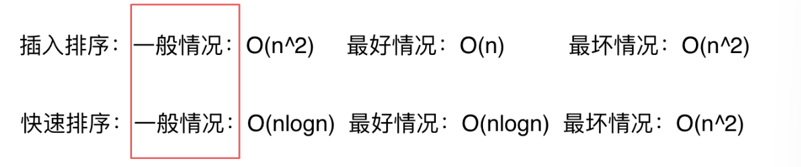
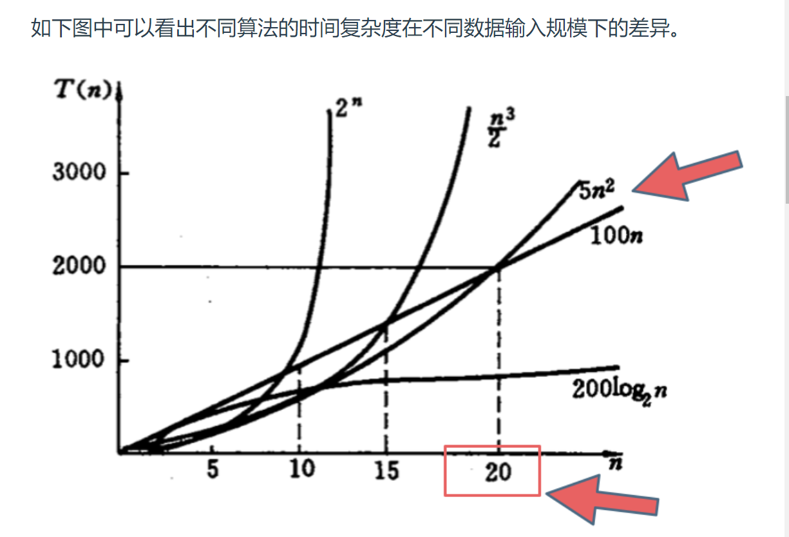
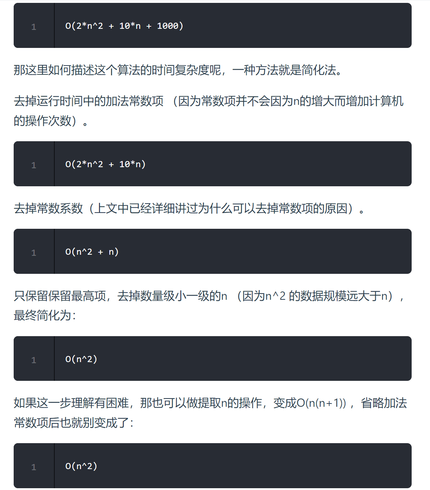
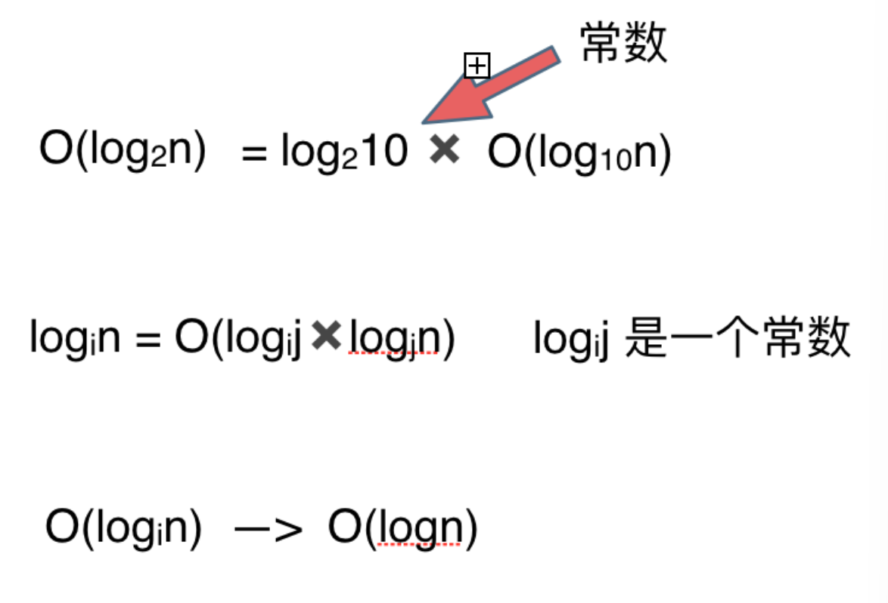
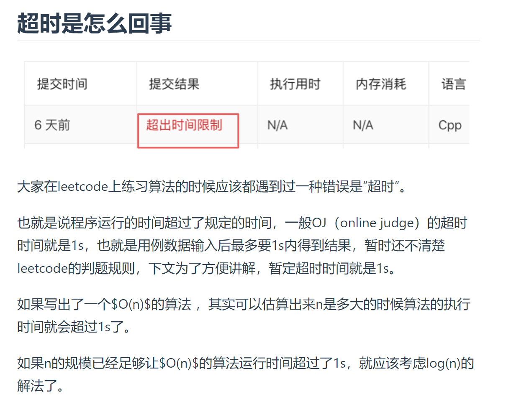
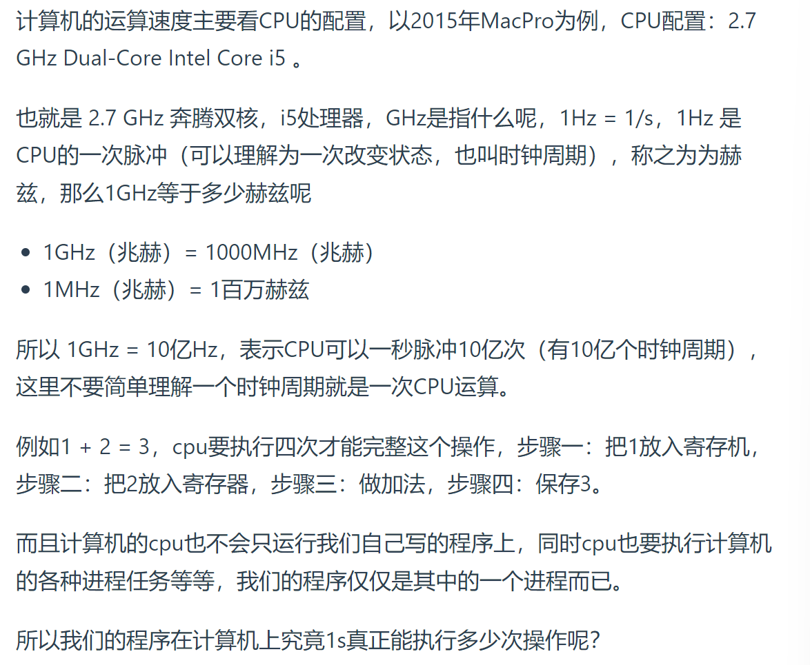
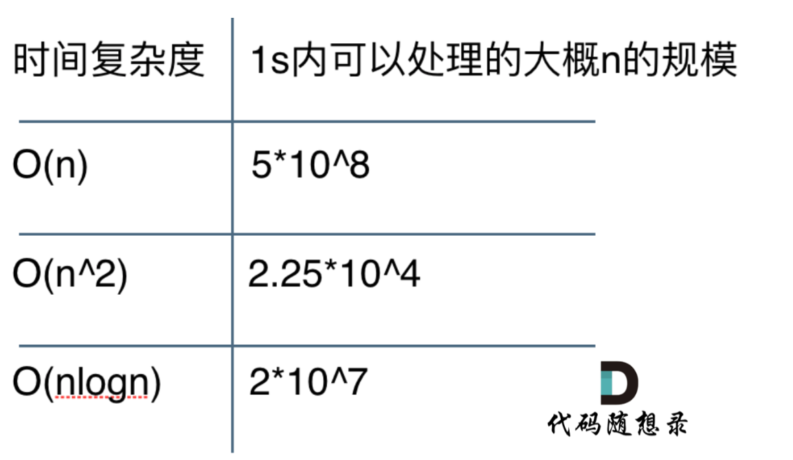

# 时间复杂度

## 什么是大O

- **大O用来表示上界**，当用它作为算法的最坏情况运行时间的上界，就是对任意数据输入的运行时间的上界。

- 我们所说的`O`代表的就是一般情况，而不是严格的上界。

- **面试中说到时间复杂度，多少指的是一般情况。**但是如果面试官和我们深入探讨一个算法的实现以及性能的时候，就要时刻想着数据用例的不一样，时间复杂度也是不同的，这一点是一定要注意的。

## 不同数据规模的差异

- 

- 在决定使用哪些算法的时候，不是时间复杂越低的越好（因为简化后的时间复杂度忽略了常数项等等），要考虑数据规模，如果数据规模很小甚至可以用`O(n^2)`的算法比`O(n)`的更合适（在有常数项的时候）。

- 计算时间复杂度时忽略常数项系数的原因：**因为大O就是数据量级突破一个点且数据量级非常大的情况下所表现出的时间复杂度，这个数据量也就是常数项系数已经不起决定性作用的数据量。**

- 我们说的时间复杂度都是省略常数项系数的，是因为一般情况下都是默认数据规模足够的大，基于这样的事实，给出的算法时间复杂的的一个排行如下所示：  
  > O(1)常数阶 < O(logn)对数阶 < O(n)线性阶 < O(n^2)平方阶 < O(n^3)立方阶 < O(2^n)指数阶
  - 但是也要注意大常数，如果这个常数非常大，例如10^7 ，10^9 ，那么常数就是不得不考虑的因素了。

## 复杂表达式的化简：

- 

## O(logn)中的log是以什么为底？

平时说这个算法的时间复杂度是logn的，那么一定是log 以2为底n的对数么？

- 其实不然，也可以是以10为底n的对数，也可以是以20为底n的对数，**但我们统一说 logn，也就是忽略底数的描述。**

- 忽略底数的原因：

## 总结：

- [ ] 什么是时间复杂度
- [ ] 复杂度用来干什么
- [ ] 数据规模对时间复杂度的影响
- [ ] 大O的定义，以及log究竟是以谁为底
- [ ] 如何简化复杂的时间复杂度

# 算法为什么会超时

- 

## 从硬件配置看计算机的性能

- 

## 测试实验

**测试程序需要注意的地方**
  - CPU执行每条指令所需的时间实际上并不相同，例如加法和乘法操作的耗时实际上都是不一样的。
  - 现在大多计算机系统的内存管理都有缓存技术，所以频繁访问相同地址的数据和访问不相邻元素所需的时间也是不同的。
  - 计算机同时运行多个程序，每个程序里还有不同的进程线程在抢占资源。

- **任何开发计算机程序的软件工程师都应该能够估计这个程序的运行时间是一秒钟还是一年。**

- 

## 递归算法的时间复杂度

- 同一道题目，同样使用递归算法，有的同学会写出了O(n)的代码，有的同学就写出了O(logn)的代码。
